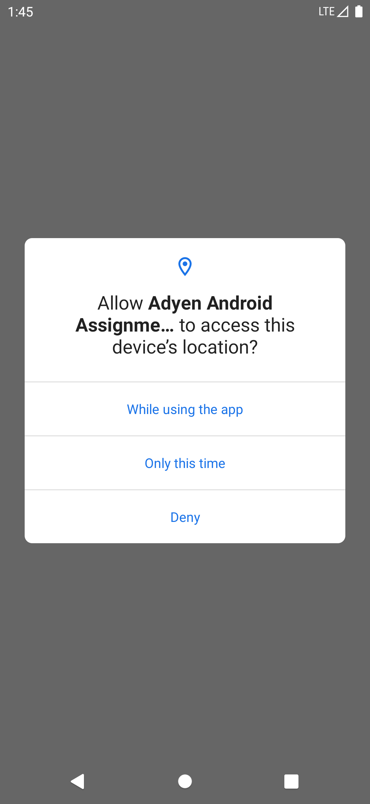
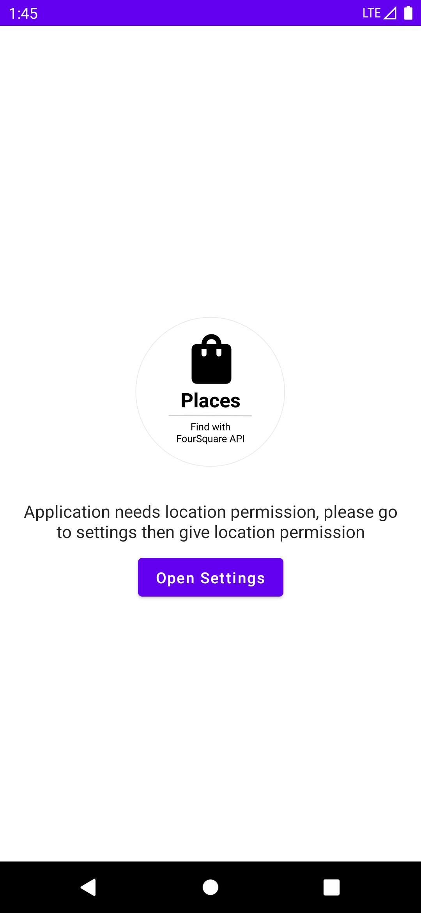
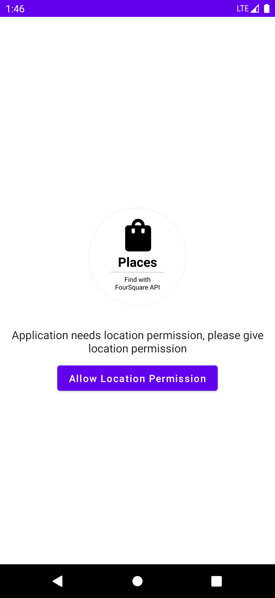
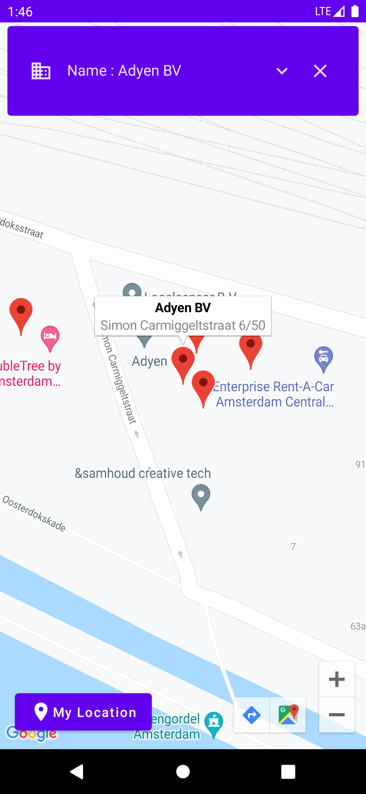
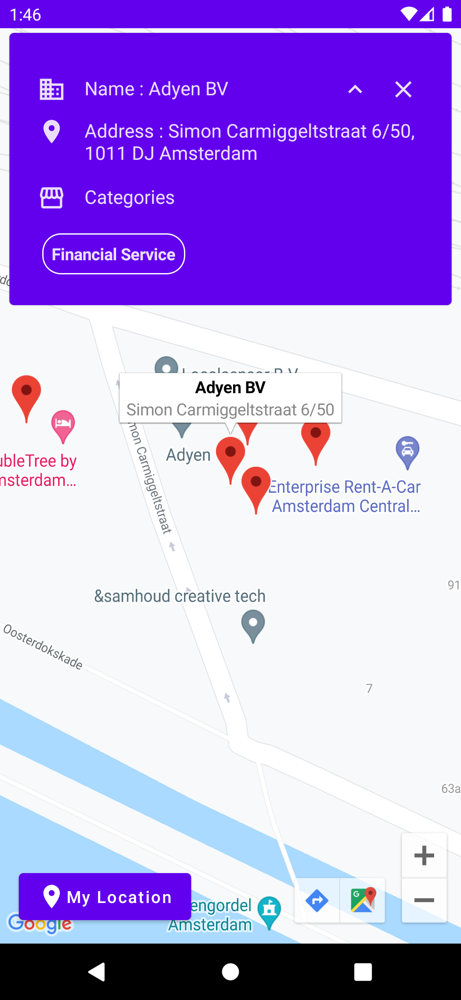
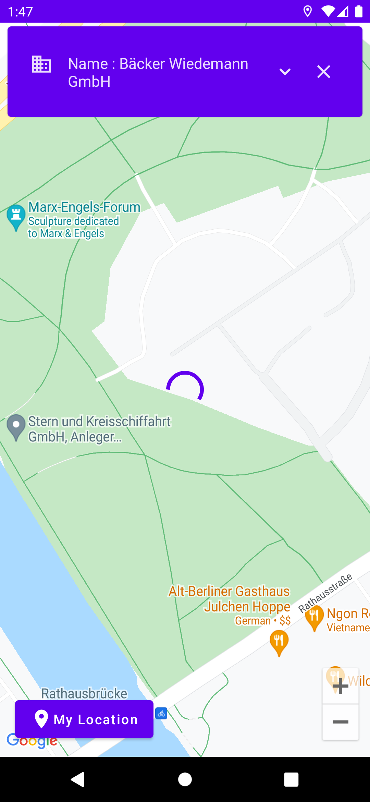
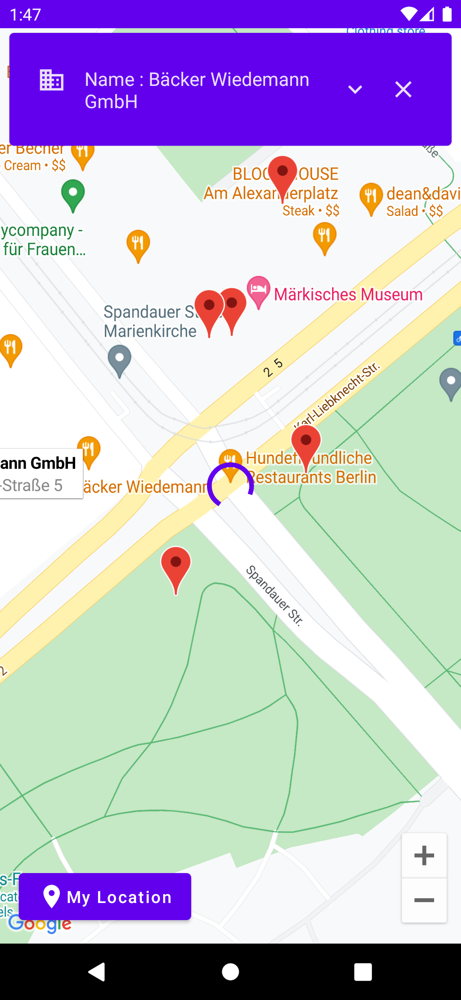
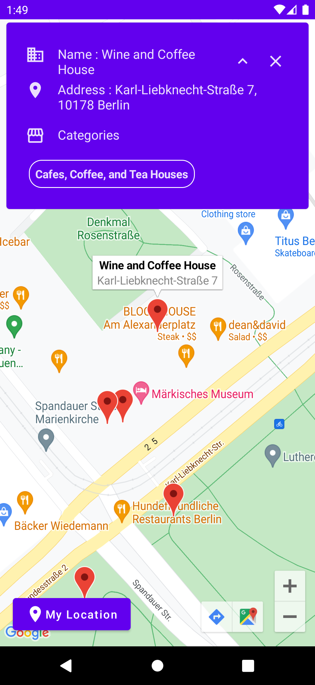

# Adyen Android Assignment - Ismail Oguzhan Ay

# 📍 Foursquare Places API - Android Application

    

An android assignment project with Jetpack Compose, Coroutines, ViewModel, LiveData, Retrofit, Hilt and based on MVVM by using Foursquare Places API and Google Maps Compose.

## ℹ Introduction

It is about a demonstration application with Foursquare Places API. You get places(venues) information from Foursquare Places API service, then shows them on Google Maps. When you click on a place(marker on map), get details about the place. It starts with Adyen location, if you want see your current location places, you can click my location button and get them.

## What You Will Need

**Hardware Requirements**
- A computer that can run Android Studio.
- An Android phone for debugging.

**Software Requirements**
- Android SDK package
- Android Studio 4.X

## 🛠 Features

- Get location permissions
- Get user current location
- Show nearby places on Google Map
- Show places information on Google Map

## 📱 Screenshots

  
  
  

  
  
  

  
  
  

## 📲 Download

Go to the [Releases](https://github.com/isoguzay/FoursquareApiCompose/releases) to download the latest APK.

## 🏗 Tech Stack

### Architecture

- 100% Kotlin based, including Gradle files
- MVVM Clean & Single-Based Architecture
- Repository Pattern

### Libraries

- Minimum SDK level 21 + based on [Kotlin](https://kotlinlang.org/)

- [Coroutines](https://github.com/Kotlin/kotlinx.coroutines) - Perform asynchronous operations

- [Hilt](https://dagger.dev/hilt/) - for dependency injection

- Jetpack Libraries
    - [Compose](https://developer.android.com/jetpack/compose/documentation) - Build modern declarative Android UI
    - [Lifecycle](https://developer.android.com/jetpack/compose/lifecycle) - Observe lifecycle state changes
    - [ViewModel](https://developer.android.com/topic/libraries/architecture/viewmodel) - Store UI related data

- [Retrofit Client](https://square.github.io/retrofit/) - Execute network service calls
- [Splash API](https://developer.android.com/guide/topics/ui/splash-screen) - Customize your Splash without effort
- [Timber](https://github.com/JakeWharton/timber) - Log your messages

### Services

- [Foursquare API Service](https://developer.foursquare.com/docs/places-api-getting-started) - FourSquare Places API 🗺📍
- [Google Maps Compose](https://developers.google.com/maps/documentation/android-sdk/maps-compose) - Google Maps with Jetpack Compose 🌍

## 📍 How to get the Foursquare API key?

Register [here](https://developer.foursquare.com/docs/manage-api-keys) and get your own Foursquare API key for your builds. You should add your API key to local.gradle.

## 🌍 How to get the Google MAPS API key?

Register [here](https://developers.google.com/maps/documentation/android-sdk/maps-compose) and get your own Google Maps API key for your builds. You should add your API key to as a meta-data under the AndroidManifest.xml file.

# 💳 Cash Register App

Implement logic of cash register module. It gets two parameters with price and amountPaid. Cash register also has change values. The arithmetic operation calculate the minimal result of change operation. 

For more information, please check test cases.

# Adyen Android Assignment - Requirements

This repository contains the coding challenge for candidates applying for a Senior Android role at Adyen.
It consists of two unrelated parts:

## 1. Cash Register
Your first task is to implement a cash register. See the `cashregister` module.

Criteria:
- The `CashRegister` gets initialized with some `Change`.
- When performing a transaction, it either returns a `Change` object or fails with a `TransactionException`.
- The `CashRegister` keeps track of the `Change` that's in it.

Bonus points:
- The cash register returns the minimal amount of change (i.e. the minimal amount of coins / bills).

## 2. App
Your second task is to implement a small app using the Foursquare Places API. See the `app` module.

The app should show a list of venues around the user’s current location.
Decide yourself which venue details should be relevant to the user. You have full freedom on how to present data on screen.
We've already added some code to make it a bit easier for you, but you are free to change any part of it.
We are going to check your implementation for understanding Android specifics (like handling configuration changes), UX choices, and overall architecture.
You are free to add any feature or code you want, but we also value quality over quantity, so whatever you decide to do, try to show us your best.

### Setup
Add your Foursquare client ID and secret to `local.gradle`. See `local.gradle.example` for details.
Tip: You can verify your credentials with `src/test/java/com/adyen/android/assignment/PlacesUnitTest.kt`# FoursquareApiCompose